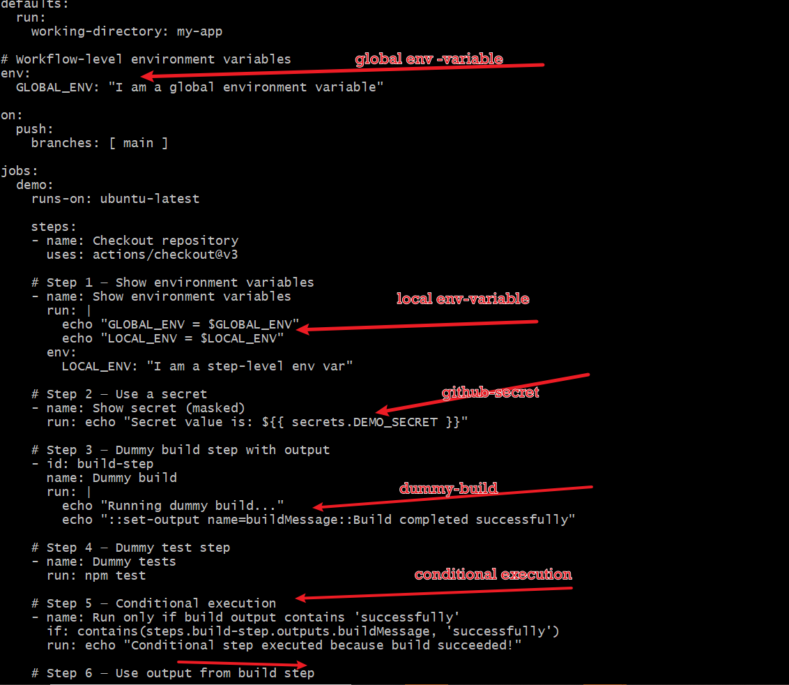
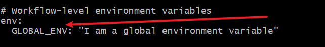
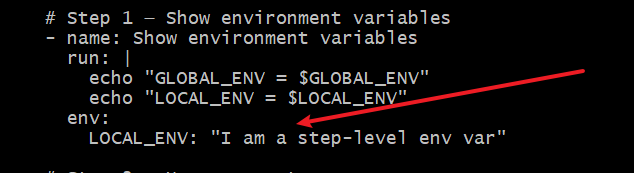
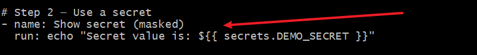
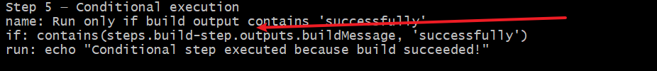
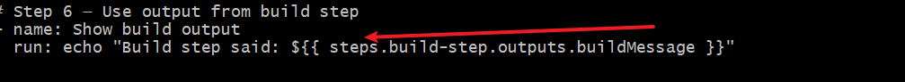
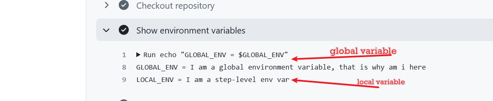
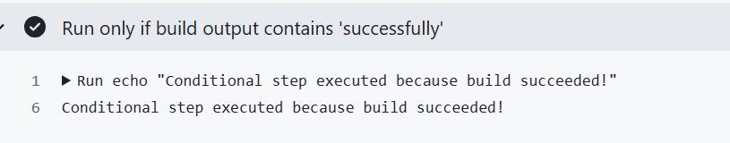

# github-action-dummy

# GitHub Actions and CI/CD Course Project - YAML
Welcome to this engaging and practical course on GitHub Actions and Continuous Integration/Continuous Deployment (CI/CD). In this course, you'll embark on a journey to master the art of automating your software development processes using one of the most powerful tools available on GitHub. Whether you're a seasoned developer or a beginner, this course is designed to equip you with the essential skills needed to streamline your development workflow, enhance the quality of your code, and significantly reduce the time to deploy new features and fixes.

### Why This Course is Relevant for Learners

Imagine you are a conductor of an orchestra. Each musician (developer) plays a different instrument (code) and must synchronize perfectly to create harmonious music (software). In this scenario, GitHub Actions and CI/CD processes are like your conductor's baton, helping you to orchestrate the diverse elements of software development. Just as a conductor ensures that each musician enters at the right time and the music flows smoothly, CI/CD coordinates the various stages of development, testing, and deployment, ensuring that the final product is delivered seamlessly and efficiently. This course, therefore, is not just about learning the technicalities of GitHub Actions; it's about learning how to conduct your software development orchestra with skill and precision, leading to a symphony of streamlined processes and high-quality outcomes.

## Lesson 3: Workflow Syntax and Structure
### Objectives:
- Understand YAML syntax for workflows.
- Learn the structure and components of a workflow.
### Pre-requisites
- GitHub Account:

Necessary for repository management and GitHub Actions.
Sign up at GitHub.
- Git Installed:

Required for version control and managing code changes.
Installation guide: Git Installation.
- Basic Knowledge of Git:

Understanding of basic Git commands (clone, commit, push, pull).
Tutorial: Git Basics.
- Node.js and npm Installed:

Node.js is the runtime for the project, and npm is the package manager.
Download and installation: Node.js Downloads.
Verify installation with node -v and npm -v in the terminal.
- Familiarity with JavaScript:

Basic understanding of JavaScript programming.
Tutorial: JavaScript Guide.
- Text Editor or IDE:

A code editor such as Visual Studio Code, Atom, or Sublime Text.
Visual Studio Code: Download VS Code.
- Access to a Command Line Interface (CLI):

Terminal on macOS/Linux or Command Prompt/PowerShell on Windows.
Guide: The Command Line Interface.
- Basic Understanding of YAML:

YAML is used for writing GitHub Actions workflows.
Tutorial: Learn YAML in Y Minutes.
- Internet Connection:

Required for accessing GitHub, documentation, and online resources.
- Willingness to Learn and Experiment:

- Openness to exploring new tools and troubleshooting.
Lesson Details:
YAML Syntax for Workflows:

1. YAML is a human-readable data serialization standard used for configuration files.
- Key concepts: indentation, key-value pairs, lists.
Example snippet:

`name: Example Workflow`

`on: [push]`

2. Workflow Structure and Components:

- Workflow File: Located in .github/workflows directory, e.g., main.yml.
- Jobs: Define tasks like building, testing, deploying.
- Steps: Individual tasks within a job.
- Actions: Reusable units of code within steps.
- Events: Triggers for the workflow, e.g., push, pull_request.
- Runners: The server where the job runs, e.g., ubuntu-latest.
- Module 3: Implementing Continuous Integration
Lesson 1: Building and Testing Code
### Objectives:
Set up build steps in GitHub Actions.
Run tests as part of the CI process.
Setting Up Build Steps:
1. Defining the Build Job:

In your GitHub Actions workflow file (e.g., .github/workflows/main.yml), start by defining a job named build.
This job is responsible for building your code.

Copy
jobs:
  build:
    runs-on: ubuntu-latest
    steps:
    # Steps will be defined next

2. Adding Build Steps:

Each step in the job performs a specific task.
Here, we add three steps: checking out the code, installing dependencies, and running the build script.

steps:
- uses: actions/checkout@v2

   'actions/checkout@v2' is a pre-made action that checks out your repository under $GITHUB_WORKSPACE, so your workflow can access it.

- name: Install dependencies

  run: npm install

   'npm install' installs the dependencies defined in your project's 'package.json' file.

- name: Build

  run: npm run build

   npm run build' runs the build script defined in your 'package.json'. This is typically used for compiling or preparing your code for deployment

Running Tests in the Workflow:

Adding Test Steps:

After the build steps, include steps to execute your test scripts.
This ensures that your code is not only built but also passes all the tests.

Copy
- name: Run tests

  run: npm test

'npm test' runs the test script defined in your 'package.json'. It's crucial for ensuring that your code works as expected before deployment.

### Learner Notes:
The build job consists of steps to check out the code, install dependencies, build the code, and run tests.

The runs-on: ubuntu-latest line specifies that the job should run on the latest version of Ubuntu provided by GitHub Actions.
Using actions like actions/checkout@v2 helps in leveraging community-maintained actions to simplify common tasks.

Commands like npm install, npm run build, and npm test are standard Node.js commands used for managing dependencies, building, and testing Node.js applications.
Additional YAML Concepts in GitHub Actions
Objectives:

Deepen understanding of advanced YAML features used in GitHub Actions.
Explore the use of environment variables and secrets in workflows.
Detailed Steps and Code Explanation:
Using Environment Variables:

Environment variables can be defined at the workflow, job, or step level.
They allow you to dynamically pass configuration and settings.

Copy
- env:
  CUSTOM_VAR: value
Define an environment variable 'CUSTOM_VAR' at the workflow level.

- -jobs:
  example:
    runs-on: ubuntu-latest
    steps:
    - name: Use environment variable
      run: echo $CUSTOM_VAR
      Access 'CUSTOM_VAR' in a step.

- Working with Secrets:

Secrets are encrypted variables set in your GitHub repository settings.
Ideal for storing sensitive data like access tokens, passwords, etc.

`jobs:

  deploy:

    runs-on: ubuntu-latest

    steps:
    - name: Use secret
      run: |
        echo "Access Token: ${{" secrets.ACCESS_TOKEN "}}"
        # Use 'ACCESS_TOKEN' secret defined in the repository settings.`

- Conditional Execution:

You can control when jobs, steps, or workflows run based on conditions.

jobs:
  conditional-job:

    runs-on: ubuntu-latest
    if: github.event_name == 'push' && github.ref == 'refs/heads/main'
    # The job runs only for push events to the 'main' branch.
    steps:
    - uses: actions/checkout@v2

- Using Outputs and Inputs between Steps:

Share data between steps in a job using outputs.

jobs
  example:

    runs-on: ubuntu-latest
    steps:
    - id: step-one
      run: echo "::set-output name=value::$(echo hello)"
      # Set an output named 'value' in 'step-one'.
    - id: step-two
      run: |
        echo "Received value from previous step: ${{" steps.step-one.outputs.value "}}"
        # Access the output of 'step-one' in 'step-two'.
Learner Notes:

Environment variables and secrets are crucial for managing configurations and sensitive data in your CI/CD pipelines.
Conditional execution helps tailor the workflow based on specific criteria, making your CI/CD process more efficient.
Sharing data between steps using outputs and inputs allows for more complex workflows where the output of one step can influence or provide data to subsequent steps.
These advanced features enhance the flexibility and security of your GitHub Actions workflows, enabling a more robust CI/CD process

## To demostrate the following

- Global environment variables

- Step‑level environment variables

- Secrets

- Step outputs

- Conditional execution

we will be using the below ci.yml file 

This file shows starts with settin up a global variable

2. The revelant step 2 shows setting up of local variable which can only be used under the step compared to a global variable that can used or referenced anywhere in the workflow.

3. The configured secret in github is referenced here.Though this is not used to authenticate any repository,but it demostrates the use of secret.

4. Input message: the build shown below demostartes the input nd expected output.

. This sets the output message name=buildmessage, which is `Build completed successfully`

5. The conditional execution is shown here.

This says that if the build output contains successful, proceed to echo the message `Conditional step executed because build succeeded`

6. The output from the input is seen below

 This will output the build message..

Checking the output of our file, we have the below

- Verfiying our environment 

-verifying secret

The secret is encoded as expected.

- verfying condition set

it ran because of the stated condition of success.

- verifying out 

This line of code has outputted the input.

End of project work.

